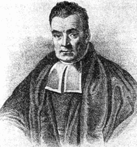

```{r setup, include = FALSE}
knitr::opts_chunk$set(
  collapse = TRUE,
  comment = "#>"
)
library(ggforce)
library(tidyverse)
```

```{r, echo=FALSE}

htmltools::includeHTML("header.html")
htmltools::includeCSS("QUTReadings.css")

```

#  Bayesian Statistics

In the first half of this unit, we have learned frequentist or classical approaches to statistical inference.  Probabilistic models and the likelihood function are the basis for classical methods that focus on sample data's behaviour.  The underlying assumption is that the inference processes' uncertainty is due to the randomness in the data, as the parameters are unknown quantities, not random variables.  Given unlimited data, all the uncertainty disappears, and we can make "perfect" accurate inference.  

The second half of this unit focuses on Bayesian approaches to statistical inference.  Bayesian approaches take a stark turn away from classical methods.  In addition to relying on the likelihood function as a means of describing the data and its relationship to the model, Bayesian statistics considers the uncertainty in our knowledge (i.e.\ inference) due also to the fact that the parameters are random variables. We express our uncertainty directly through probabilistic statements about the parameters rather than attributing the uncertainty in our inferences solely to the data. 

Each approach has its advantages and disadvantages in a given situation; in some cases, one might prefer one method over the other.  Ultimately both approaches are concerned with the same goals of inference and decision making and can be shown to complement and overlap each other in many aspects.  

## Conditional Probability and Bayes Theorem

Bayes' theorem is at heart an exploration of conditional probability.  It deals with computing the conditional probability of two variables without knowing their joint distribution, just their converse conditional probability and their marginal probabilities. Understanding Bayes' theorem is derived by examining the definition of conditional probability and rewriting with respect to the converse conditional probability

$$
Pr(A|B)=\frac{Pr(A\cap B)}{Pr(B)}.
$$
 
The definition is the joint probability divided by the marginal probability, which can seem confusing when trying to intuit Bayes' theorem.  Venn diagrams can help make our understanding of this definition more visceral by presenting the definition above as the ratio of the shared area of $A$ and $B$ and the area of $B$. 

```{r,echo=FALSE,warning=FALSE,message=FALSE}
df.venn <- data.frame(x = c(-0.866, 0.866),
                      y = c(-0.5, -0.5),
                      labels = c('A', 'B'))
ggplot(df.venn) +
  geom_circle(aes(x0 = x, y0 = y, r = c(1.5,1.5), fill = labels), alpha = .3, size = 1, colour = 'grey') +
  coord_fixed() +
  theme_void() +
  theme(legend.position = 'none') +
  scale_fill_manual(values = c('cornflowerblue', 'firebrick')) +
  scale_colour_manual(values = c('cornflowerblue', 'firebrick'), guide = FALSE) +
  labs(fill = NULL) +
  annotate("text", x = c(df.venn$x,0.0), y = c(df.venn$y,-0.5), label = c("A","B",expression(paste("A",intersect(B)))))


```

Note that if $Pr(A)=Pr(B)\Rightarrow Pr(A|B)=Pr(B|A)$, that is if both
$A$ and $B$ are equally likely, then their conditional distributions are
also equal.

```{r,echo=FALSE,warning=FALSE,message=FALSE}
df.venn <- data.frame(x = c(-0.866, 0.866),
                      y = c(-0.5, -0.5),
                      labels = c('A', 'B'))
ggplot(df.venn) +
  geom_circle(aes(x0 = x, y0 = y, r = c(1.5,1), fill = labels), alpha = .3, size = 1, colour = 'grey') +
  coord_fixed() +
  theme_void() +
  theme(legend.position = 'none') +
  scale_fill_manual(values = c('cornflowerblue', 'firebrick')) +
  scale_colour_manual(values = c('cornflowerblue', 'firebrick'), guide = FALSE) +
  labs(fill = NULL) +
  annotate("text", x = c(df.venn$x,0.34), y = c(df.venn$y,-0.5), label = c("A","B",expression(paste("A",intersect(B)))))


```

:::{.sidenote}
**Example:**\
If $80\%$ of criminals are men, i.e.:
$$
Pr(C|M)=0.8
$$
does not mean that $80\%$ of men are criminals.
&nbsp;

**(WARNING: THESE NUMBERS ARE NOT NECESSARILY ACCURATE AND ARE INTENDED FOR ILLUSTRATIVE PURPOSES ONLY!)**
:::

If $Pr(A)\neq Pr(B)\Rightarrow Pr(A|B)\neq Pr(B|A)$, in other words, if
$A$ and $B$ are not equally likely, then neither are their conditional
distributions.

:::{.boxed}
**Example (cont'd):**\
If $80\%$ of criminals are men, i.e.:
$$
Pr(M|C)=0.8
$$
does not mean that $80\%$ of men are criminals. 

We can use our definitions of conditional probability to answer this if we know that approximately $50\%$ of the population are men, and approximately $1\%$ of the population are criminals.

The probability that someone is a criminal, given that they are a man, is
$$
\begin{align}
Pr(M|C)&=\frac{Pr(M\cap C)}{Pr(C)}\\
\end{align}
$$
tells us that
$$
\begin{align}
Pr(M\cap C)&=Pr(M|C)Pr(C)\\
&=0.8\times 0.01\\
&=0.008
\end{align}
$$
Because $Pr(M\cap C)=Pr(C\cap M)$ we can then find $Pr(C|M)$
$$
\begin{align}
Pr(C|M)&=\frac{Pr(C\cap M)}{Pr(M)}\\
&=\frac{0.008}{0.5}\\
&=0.016
\end{align}
$$
This result is Bayes' Theorem in action, we can see that most definitely that while being a criminal means that there is a good chance that you are a man, but the converse is not true; that being a man doesn't necessarily make you a criminal.

&nbsp;

**(WARNING: THESE NUMBERS ARE NOT NECESSARILY ACCURATE AND ARE INTENDED FOR ILLUSTRATIVE PURPOSES ONLY!)**

:::

This example's results are interesting, i.e.\ $Pr(A|B) = Pr(B|A)$ is rarely true, but it is a common logical and cognitive error.  Here is a more formal statement and proof of Bayes Theorem.   

:::{.sidenote}
**Example:**\
Given Bayes' Theorem, 
$$
Pr(B|A)=\frac{Pr(A|B)Pr(B)}{Pr(A)}
$$ 
show that
if 
$$
Pr(A)>Pr(B)\mbox{ then }Pr(A|B)>Pr(B|A)
$$ 
and if
$$
Pr(B)>Pr(A)\mbox{ then }Pr(A|B)<Pr(B|A).
$$
Find the quantity that
satisfies the proportionality 
$$
Pr(A|B)\propto Pr(B|A).
$$

:::

:::{.boxed}
**Bayes' Theorem:**\
$$
Pr(B|A)=\frac{Pr(A|B)Pr(B)}{Pr(A)}
$$
We can prove this result using the definition of conditional probability to define the joint probability of $A\cap B$
$$
\begin{align}
Pr(A|B)&=\frac{Pr(A\cap B)}{Pr(B)}\\
Pr(A|B)Pr(B)&=Pr(A\cap B).
\end{align}
$$
Then we can write the conditional probability of $B|A$ 
$$
\begin{align}
Pr(B|A)&=\frac{Pr(A\cap B)}{Pr(A)}\\
&=\frac{Pr(A|B)Pr(B)}{Pr(A)}
\end{align}
$$
yielding Bayes' Theorem. 

:::

:::{.boxed}
**Example (cont'd):**\
Show that if $Pr(A)>Pr(B)$ then $Pr(A|B)>Pr(B|A)$\
**Proof:**\
$$
\begin{align}
Pr(A|B)&>Pr(B|A)\\
\frac{Pr(A\cap B)}{Pr(B)}&>\frac{Pr(A\cap B)}{Pr(A)}\\
\frac{1}{Pr(B)}&>\frac{1}{Pr(A)}\\
Pr(B)&<Pr(A)
\end{align}
$$
Find the constant of proportionality that satisfies the relationship $Pr(A|B)\propto Pr(B|A)$\
**Proof:**\
$$
\begin{align}
Pr(B|A)&=\frac{Pr(A|B)Pr(B)}{Pr(A)}\\
&=\frac{Pr(B)}{Pr(A)}Pr(A|B)
\end{align}
$$
so the proportionality relationship is 
$$
\frac{Pr(B)}{Pr(A)}.
$$

:::

The results of this further reinforce the idea of Bayes' theorem and illustrate that 
$$
Pr(A|B)=Pr(B|A)\iff Pr(A)=Pr(B).
$$


#  The Bayesian Paradigm 

:::{.sidenote}
**The Birth of Bayesian Statistics**\
<center>
{width=150px}\
The Reverend Thomas Bayes
</center>\

Thomas Bayes was an eighteenth-century Presbyterian minister in rural England who was also a mathematician and philosopher.  In his lifetime Bayes is known to have published only one scientific paper, a defence of Newton's method of fluxions.  On the strength of this paper, it is believed Bayes was elected a Fellow of the nascent Royal Society in 1742, but he never published again in his lifetime. 

Sometime after becoming a Fellow, Bayes became interested in probability and began working on probability theory.  After his death, his friend Richard Price retrieved Bayes' unpublished manuscript *An Essay towards solving a Problem in the Doctrine of Chances*. Price edited the manuscript and added a forward extolling the philosophical virtues of what is now known as Bayes' Theorem.

Since its publication, Bayes' Theorem has grown to be one of the single most important theorems in mathematics.  It serves as the basis for the entire field of Bayesian Statistics and is one of the foundations of Machine Learning and Artificial Intelligence.

:::


Classical statistical inference methods are akin to deductive reasoning. We assume a truth about the state of nature and then test that truth with an experiment designed to fail if our beliefs are false, either accepting or rejecting our beliefs. Bayes' theorem presents a completely new paradigm for inference that is in effect the mathematical incarnation of inductive reasoning.  In simple terms, Bayes' theorem suggests that we begin with our beliefs about the state of nature (not an absolute truth), and we update those beliefs as we gain experience.  The crucial difference is that the state of nature in classical statistical inference is assumed to be an unknown but fixed quantity represented as a parameter, e.g.\ $\theta$.  In Bayesian statistics, we describe our beliefs about the state of nature as a probability distribution.

##  The Likelihood

Both classical and Bayesian statistics make use of the likelihood function to connect our observed data $\mathbf{x}=x_1,x_2,\dots,x_n$ to the state of nature $\theta$ via a probabilistic model.  There is a difference in how we conceptualise them.  In classical statistics, we write the likelihood as a function of $\theta$
$$
L(\theta|\mathbf{x})=\prod_{i=1}^nf(x_i;\theta)
$$
The maximum likelihood method's goal is to find the estimator $\hat{\theta}$ that maximises the likelihood function with respect to $\theta$; hence the likelihood is a function of $\theta$.

In Bayesian statistics, we write the likelihood as a conditional probability distribution, i.e.\
$$
\begin{align}
f(\mathbf{x}|\theta)&=\prod_{i=1}^nf(x;\theta)\\
&\equiv L(\theta|\mathbf{x})
\end{align}
$$
computed exactly as the likelihood function, except that now we consider it a function of the data conditioned on $\theta$. The reason for this will become clear as we proceed, but it is important to know that computationally these are the same functions, and for a given set of data $\mathbf{x}=x_1,x_2,\ldots,x_n$ and a fixed value of $\theta$ they will yield the same value. However, they are conceptually quite different; in classical statistics, the likelihood is a function of $\theta$, but it is not a probability distribution of $\theta$.  In Bayesian statistics *both* the data $\mathbf{x}$ and the parameter $\theta$ are random variables; hence the likelihood is in effect the joint density function for the data, conditioned on the parameter $\theta$.  

Yes, this seems bizarre at first, and it doesn't help that $f$ is used for both the likelihood and the probability distribution of the data but will become less strange with practice.  

##  The Prior

:::{.sidenote}
**Prior Distributions:**
Consider an example where we wanted to evaluate the "fairness" of a coin.  We would model our data as coming from a binomial distribution. Still, We would also need a prior probability distribution to describe our beliefs about the value $p$ or the probability of the coin coming up heads. 

What prior(s) would be reasonable if we had strong evidence $p\approx 1$?  

What would a vague or non-informative prior look like?


:::

The prior distribution is an interesting concept in Bayesian statistics.  It embodies our prior knowledge or beliefs about $\theta$ the state of nature (i.e.\ the model parameters); this contrasts with classical methods where we assume no knowledge or beliefs about $\theta$.  

The prior can be a powerful influence on our analyses and our inference results; this is a double-edged sword.  In some cases, we have strong, reliable information about $\theta$ (e.g.\ the results of preliminary analyses or expert knowledge) that should be included in our analyses.  

In this case, we would want to use an *informative prior* or one that focuses mass at specific values. In other instances where we didn't know much about $\theta$, we would want to use a *vague* or *non-informative prior*, which was diffuse and offered minimal if any information about the value of $\theta$ to affect the results of our analyses. 

:::{.boxed}
**Prior Distributions (cont'd):**
Consider an example where we wanted to evaluate the "fairness" of a coin.  We would model our data as coming from a binomial distribution. We would also need to use a prior probability distribution to describe our beliefs about the value $p$ or the probability of the coin coming up heads. 

If we had strong evidence that $p\approx 1$ then we might choose a prior $\pi(\theta)$ that looked like this:

```{r,echo = FALSE,out.width="75%"}
x<-seq(0,1,len=10000)
y<-dbeta(x,10,1)
df<-tibble(x,y)
ggplot(df,aes(x=x,y=y))+
         geom_line()+
          xlab("p")+
          ylab(expression(pi(p)))
```
Note that most of the mass of the density function is at or near $p=1$.

If we wanted a vague or non-informative prior, we might specify a prior like this:
```{r,echo = FALSE,out.width="75%"}
x<-seq(0,1,len=10000)
y<-dbeta(x,1,1)
df<-tibble(x,y)
ggplot(df,aes(x=x,y=y))+
         geom_line()+
          xlab("p")+
          ylab(expression(pi(p)))
```
where the mass is evenly distributed between $0$ and $1$, meaning that we believe that any value in the interval $[0,1]$ is equally likely.  

Or we might choose a prior $\pi(p)$ that looks like this:
```{r,echo = FALSE,out.width="75%"}
x<-seq(0,1,len=10000)
y<-dbeta(x,0.5,0.5)
df<-tibble(x,y)
ggplot(df,aes(x=x,y=y))+
         geom_line()+
          xlab("p")+
          ylab(expression(pi(p)))
```
where the probability mass is concentrated at the margins, i.e.\ we strongly believe that $p=0$ **or** $p=1$, this may seem counter-intuitive.  We will see later that mathematically this has minimal influence on the results of our analyses.  

:::

##  The Posterior

:::{.sidenote}
**Analytic solutions to the posterior distribution:**\
In some cases, there are analytical solutions to find the closed form of
the posterior. The following pairs of likelihoods and priors yield
closed forms for their posterior distributions

-   $y\sim Binom(\theta,n),\quad\theta\sim Be(a,b)$

-   $y\sim Pois(\theta),\quad\theta\sim Ga(a,b)$

<!--
-   $y\sim N(\theta,\sigma^2),\quad\theta\sim (\mu_0,\tau)$
-->
Find these closed forms. Note in these cases; it is likely not necessary
to explicitly solve the integral for the normalising constant.
:::

In classical statistics, the parameter is considered a fixed but
unknown quantity. The estimator is a function of the data, which are realisations of a random variable, making the estimator a random variable.  Uncertainty
is quantified and described using the sampling distribution, and the
observed data are considered the only source of information about the
parameter.

In Bayesian statistics, parameters are considered random variables described by density functions instead of point estimators.  We use the likelihood and the prior to obtain the posterior distribution of the parameter and base our inference on that posterior rather than the estimator's asymptotic properties and the sampling distribution.

The likelihood is our connection between the data the model, and the prior is an expression of our prior knowledge of $\theta$, and we apply Bayes' Theorem to find the posterior
distribution of the parameter.
$$
\pi(\theta|\mathbf{x})=\frac{f(\mathbf{x}|\theta)\pi(\theta)}{\int_{\Theta}f(\mathbf{x}|\theta)\pi(\theta)d\theta}
$$
We write the likelihood in terms of the data's probability given $\theta$, and the prior distribution is the marginal distribution of $\theta$.  The product of the likelihood and the prior is their joint distribution
$$
f(\mathbf{x}|\theta)\pi(\theta)=f(\mathbf{x},\theta)
$$
and the integral in the denominator is the marginal distribution of the data
$$
\begin{align}
f(\mathbf{x})&=\int_{\Theta}f(\mathbf{y}|\theta)\pi(\theta)d\theta\\
&=\int_{\Theta}f(\mathbf{y},\theta)d\theta
\end{align}
$$
so we can write this version of Bayes' theorem as
$$
\pi(\theta|\mathbf{x})=\frac{f(\mathbf{x}|\theta)\pi(\theta)}{f(\mathbf{x})}
$$
which is similar to the form we have seen previously. Note that the numerator is a function or the product of two functions, but $f(\mathbf{x})$ is a single value, i.e.\ the normalising constant for the posterior distribution. Hence we can write
$$
\pi(\theta|\mathbf{x})\propto f(\mathbf{x}|\theta)\pi(\theta).
$$

Rather than a single value (or point estimator) for $\theta$, Bayesian analysis returns a posterior probability for $\theta$.  Using the probability distribution for a parameter instead of a point estimator provides much more information and detail.  As a consequence, implementing Bayes' Theorem for probability distributions can be computationally challenging.  Evaluating the integral in the denominator to find the normalising constant $f(\mathbf{x})$ 
$$
\int_{\Theta}f(\mathbf{y}|\theta)\pi(\theta)d\theta=f(\mathbf{y})
$$ 
can be computationally challenging.  It is easy some times easier to find
$$
f(\mathbf{y}|\theta)\pi(\theta)
$$ 
and infer the normalising constant than to solve analytically (or numerically) for 
$$
\int_{\Theta}f(\mathbf{y}|\theta)\pi(\theta)d\theta.
$$

:::{.boxed}
**Analytic solutions to the posterior distribution (cont'd):**\
In some cases, there are analytical solutions to find the closed form of
the posterior. The following pairs of likelihoods and priors yield
closed forms for their posterior distributions

-   $x\sim Binom(\theta,n),\quad\theta\sim Be(a,b)$

-   $x\sim Pois(\theta),\quad\theta\sim Ga(a,b)$

**The Beta-Binomial Case:**\
Given a sample of size $n$ from a binomial distribution let $x=\#\mbox{ of successes}, then
$$
\begin{align}
f(x|\theta)&={n\choose x}\theta^x(1-\theta)^{n-x}\\
\pi(\theta)&=\frac{\Gamma(\alpha+\beta)}{\Gamma(\alpha)\Gamma(\beta)}\theta^{\alpha-1}(1-\theta)^{\beta-1}
\end{align}
$$
Noting that for integer values $\Gamma(z)=(z-1)!$ the posterior distribution is then
$\require{cancel}$
$$
\begin{align}
\pi(\theta|x)&=\frac{\cancel{\frac{\Gamma(n+1)}{\Gamma(x+1)\Gamma(n-x+1)}\frac{\Gamma(\alpha+\beta)}{\Gamma(\alpha)\Gamma(\beta)}}\theta^{x+\alpha-1}(1-\theta)^{n-x+\beta-1}}{\cancel{\frac{\Gamma(n+1)}{\Gamma(x+1)\Gamma(n-x+1)}\frac{\Gamma(\alpha+\beta)}{\Gamma(\alpha)\Gamma(\beta)}}\int_{\Theta}\theta^{x+\alpha-1}(1-\theta)^{n-x+\beta-1}d\theta}\\
&=\frac{\theta^{x+\alpha-1}(1-\theta)^{n-x+\beta-1}}{\int_{\Theta}\theta^{x+\alpha-1}(1-\theta)^{n-x+\beta-1}d\theta}
\end{align}
$$
because $\pi(\theta|x)$ is a proper distribution i.e.\
$$
\int_{\Theta}\pi(\theta|x)d\theta=1
$$
then the integral in the denominator of the definition of $\pi(\theta|x)$ must be the normalising constant for the beta distribution hence
$$
\pi(\theta|x)=\frac{\Gamma(n+\alpha+\beta)}{\Gamma(x+\alpha)\Gamma(n-x+\beta)}\theta^{x+\alpha-1}(1-\theta)^{n-x+\beta-1}
$$
or
$$
\theta|x\sim Be(x+\alpha,n-x+\beta).
$$

**The Gamma-Poisson Case:**\
Given a sample $\mathbf{x}=x_1,x_2,\ldots,x_n$ of size $n$ from a Poisson distribution then
$$
\begin{align}
f(\mathbf{x})&=\frac{\lambda^{\sum_{i=1}^nx_i}e^{-n\lambda}}{\prod_{i=1}^nx_i!}\\
\pi(\lambda)&=\frac{\beta^\alpha\lambda^{\alpha-1}e^{-\beta\lambda}}{\Gamma{\alpha}}.
\end{align}
$$
The posterior distribution function is
$$
\begin{align}
\pi(\lambda|\mathbf{x})&=\frac{\cancel{\frac{\beta^\alpha}{\prod_{i=1}^nx_i!\Gamma{\alpha}}}\lambda^{\sum_{i=1}^nx_i+\alpha-1}e^{-(n+\beta)\lambda}}{\cancel{\frac{\beta^\alpha}{\prod_{i=1}^nx_i!\Gamma(\alpha)}}\int_{\Lambda}\lambda^{\sum_{i=1}^nx_i+\alpha-1}e^{-(n+\beta)\lambda}d\lambda}\\
&=\frac{\lambda^{\sum_{i=1}^nx_i+\alpha-1}e^{-(n+\beta)\lambda}}{\int_{\Lambda}\lambda^{\sum_{i=1}^nx_i+\alpha-1}e^{-(n+\beta)\lambda}d\lambda}
\end{align}
$$
because $\pi(\lambda|x)$ is a proper distribution i.e.\
$$
\int_{\Theta}\pi(\lambda|x)d\theta=1
$$
then the integral in the denominator of the definition of $\pi(\lambda|x)$ must be the normalising constant for the gamma distribution hence
$$
\pi(\lambda|\mathbf{x})=\frac{(n+\beta)^{\alpha+\sum_{i=1}^nx_i}}{\Gamma\left(\alpha+\sum_{i=1}^nx_i\right)}\lambda^{\alpha+\sum_{i=1}^nx_i}e^{-(n+\beta)\lambda}
$$
or
$$
\lambda|x\sim Ga\left(\alpha+\sum_{i=1}^nx_i,n+\beta\right).
$$


:::

:::{.sidenote}
**A Word about Notation**\
Mathematical notation is a rich and detailed language; in many cases, there are multiple ways to write statements that all mean the same thing.  For Bayesian statistics in this unit, we will use the notation
$$
\begin{align}
f(\mathbf{x}|\theta)&=\mbox{The Likelihood}\\
\pi(\theta)&=\mbox{The prior distribution of }\theta\\
\pi(\theta|\mathbf{x})&=\mbox{The posterior distribution of }\theta.
\end{align}
$$
Other texts and statisticians will use other notation; one alternative is to use $p(\cdot)$ for the likelihood, the prior, and the posterior, i.e.\
$$
\begin{align}
p(\mathbf{x}|\theta)&=\mbox{The Likelihood}\\
p(\theta)&=\mbox{The prior distribution of }\theta\\
p(\theta|\mathbf{x})&=\mbox{The posterior distribution of }\theta.
\end{align}
$$
Neither of these notations is "wrong" (the second one), and neither is "right" (the first one), so it is good to keep these in mind and be flexible.  

:::


###  The Posterior as Prior and the Posterior Predictive Distribution

We can use the posterior as a new prior, allowing for updating of the posterior given new data, e.g.\ given some new data $\tilde{x}$
$$
\pi(\theta|\mathbf{x},\tilde{x})=\frac{f(\tilde{x}|\theta)\pi(\theta|\mathbf{x})}{\int_{\Theta}f(\tilde{x}|\theta)\pi(\theta|\mathbf{x})d\theta}.
$$
The denominator is the posterior predictive distribution
$$
\pi(\tilde{x}|\mathbf{x})=\int_{\Theta}f(\tilde{x}|\theta)\pi(\theta|\mathbf{x})d\theta
$$
which, as its name implies, can be used to make predictions about new values given previous observations.  

This updating process "recycling" the posterior as the new prior is one of the most powerful features of Bayes' theorem and the Bayesian paradigm. This capability represents the ability for a process to "learn" and is the basis for many methods in machine learning and artificial intelligence and underlies most (if not all) automated recommendation systems (e.g.\ Netflix etc.\ ad nauseam).

# Understanding Prior Probability Distributions 

The previous examples of finding the posterior distribution of a parameter analytically we relatively straightforward; this is because the prior distributions were *conjugate*. Conjugate prior distributions
have the property that the posterior distribution has is the same form
as the prior. Finding conjugate priors is not always straightforward,
but in the case of the exponential families of distributions, they are
easily identified.

##  The Exponential Family and Bayesian Inference

:::{.sidenote}
**Example:**\

*Using The Canonical Form*\

The following pairs of likelihoods and priors yield closed forms for
their posterior distributions

-   $y\sim Bern(\theta),\quad\theta\sim Be(a,b)$

-   $y\sim Pois(\theta),\quad\theta\sim Ga(a,b)$

Show that we can write these in canonical form and that the
resulting posteriors are also members of the exponential families.

Show that the posterior predictive distributions are ratios of the normalising constants.

:::

The [exponential family](./Week_3.html#exponential-families.html) of distributions are probability distribution
functions that can be written as:
$$
f(x|\theta)=h(x)\exp\left(\eta(\theta)T(x)-A(\theta)\right)
$$ 
and whose support is not a function of $\theta$, e.g.\ the support for the
Uniform Distribution depends explicitly on its parameters, and thus
cannot be written as a member of the exponential families.

Letting $\eta=\eta(\theta)$ we can write this in the **canonical** form
$$
f(x|\eta)=h(x)\exp\left(\eta T(x)-A(\eta)\right).
$$ 
Some of the useful properties of members of the exponential families are summarised:

:::{.boxed}

-   $T(x)$ is the sufficient statistic, recall how membership in the
    exponential families related to the [Neyman-Fisher Factorisation Theorem](./Properties_of_Estimators.html#neyman-fisher-factorisation-theorem) for
    finding sufficient statistics.

-   $\eta$ --- Natural Parameter --- When $\eta(\theta)=\eta$ the
    distribution is said to be in its canonical form.

-   $A(\theta)$ --- log-partition function --- log of the normalising
    factor.

-   Note that $T(x)$ and/or $\theta$ can be vectors.    

:::

### Conjugate Priors for Exponential Families

Given the density 
$$
f(x|\eta)=h(x)\exp\left(\eta T(x)-A(\eta)\right)
$$
The conjugate prior will have the form
$$
\pi(\eta|\mathbf{\phi},\nu)=g(\mathbf{\phi},\nu)\exp\left(\eta\phi-\nu A(\eta)\right)
$$
Note $\eta$ and or $T(x)$ maybe vectors and $\nu>0$.

The resulting posterior will have the form
$$
\pi(\eta|x)\propto\exp\left(\eta(T(x)+\phi)-(\nu+1)A(\eta)\right).
$$
This form of the posterior is the same as the form of the prior, hence as we have seen. 

### The Posterior Predictive Distribution for Exponential Families 

The posterior predictive distribution of members of the exponential families found using conjugate priors always have a closed-form but are not necessarily members of the exponential families).  Note that by definition, the posterior predictive distribution is the ratio of the normalising constants. 
    $$
    \begin{align}
    \pi(\tilde{x}|\mathbf{x})&=\int_{\theta}f(\tilde{x}|\theta)\pi(\theta|\mathbf{x})d\theta\\
    &=\int_\Theta f(\tilde{x}|\theta)\frac{f(\mathbf{x}|\theta)\pi(|\theta)}{\int_{\Theta}f(\mathbf{x}|\theta)\pi(|\theta)d\theta}\\
    &=\frac{1}{\int_{\Theta}f(\mathbf{x}|\theta)\pi(|\theta)d\theta}\int_{\Theta}f(\tilde{x}|\theta)f(\mathbf{x}|\theta)\pi(\theta)d\theta\\
    &=\frac{1}{\int_{\Theta}f(\mathbf{x}|\theta)\pi(|\theta)d\theta}\int_{\Theta}f(\tilde{x},\mathbf{x},\theta)d\theta\\    
    &=\frac{\int_\Theta f(\tilde{x},\mathbf{x},\theta)d\theta}{\int_\Theta f(\mathbf{x},\theta)d\theta}\\
    &=\frac{f(\tilde{x},\mathbf{x})}{f(\mathbf{x})}
    \end{align}
    $$
which is the ratio of the normalising constants for $\pi(\theta|\mathbf{x},\tilde{x})$ and $\pi(\theta|\mathbf{x}$.

:::{.boxed}
**Example (cont'd):**\
*The Canonical Form*\

The following pairs of likelihoods and priors yield closed forms for
their posterior distributions

-   $y\sim Bern(\theta),\quad\theta\sim Be(a,b)$

-   $y\sim Pois(\theta),\quad\theta\sim Ga(a,b)$

Show that we can write these in canonical form and that the
resulting posteriors are also members of the exponential families.

Show that the posterior predictive distributions are ratios of the normalising constants.

*The Bernoulli Distribution with Beta Prior*\

Given a sample $\mathbf{x}=x_1,x_2,\ldots,x_n$ of size $n$ from the Bernoulli probability distribution
$$
Pr(X=x)=p^x(1-p)^{1-x}
$$
the likelihood is 
$$
\begin{align}
f(\mathbf{x}|p)&=\prod_{i=1}^np^{x_i}(1-p)^{1-x_i}\\
&=p^{\sum_{i=1}^nx_i}(1-p)^{n-\sum_{i=1}^nx_i}
\end{align}
$$
we can write this in the canonical form as
$$
f(\mathbf{x}|p)=h(\mathbf{x})\exp\left(\eta T(\mathbf{x})-nA(\eta)\right)
$$
where 
$$
\begin{align}
h(\mathbf{x})&=1\\
\eta &= \log\left(\frac{p}{1-p}\right)\\
T(\mathbf{x})&=\sum_{i=1}^nx_i\\
A(\eta)&=\log(1+e^\eta).
\end{align}
$$
The prior 
$$
\pi(p)=\frac{\Gamma(\alpha+\beta)}{\Gamma(\alpha)\Gamma(\beta)}p^{\alpha-1}(1-p)^{\beta-1}
$$
has a conjugate prior of the form
$$
\begin{align}
\pi(p|\alpha,\beta)&\equiv\pi(\eta|\phi,\nu)\\
&=g(\phi,\nu)\exp\left(\eta\phi-\nu A(\eta)\right)
\end{align}
$$
where 
$$
\begin{align}
g(\phi,\nu)&=\frac{\Gamma(\alpha+\beta)}{\Gamma(\alpha)\Gamma(\beta)}\\
\eta&=\log\left(\frac{p}{1-p}\right)\\
\phi &=\alpha-1\\
\nu&=\alpha+\beta+2\\
A(\eta)&=\log(1+e^\eta).
\end{align}
$$
The posterior is then
$$
\begin{align}
\pi(p|\mathbf{x})&\propto\exp\left(\eta(T(\mathbf{x})+\phi)-(\nu+n)A(\eta)\right)\\
&\propto\exp\left\{\log\left(\frac{p}{1-p}\right)(T(\mathbf{x})+\alpha-1)-(\alpha+\beta+2+n)\log\left(1+\frac{p}{1-p}\right)\right\}\\
&\propto\left(\frac{p}{1-p}\right)^{T(\mathbf{x})+\alpha-1}\left(\frac{1}{1-p}\right)^{-(\alpha+\beta+2+n)}\\
&\propto p^{\sum_{i=1}^nx_i+\alpha-1}(1-p)^{n-\sum_{i=1}^nx_i+\beta-1}
\end{align}
$$
which confirms the results above. 

*The Poisson Distribution with Gamma Prior*\

Given a sample $\mathbf{x}=x_1,x_2,\ldots,x_n$ of size $n$ from the Poisson probability distribution
$$
Pr(X=x)=\frac{\lambda^x e^{-\lambda}}{x!}
$$
the likelihood is 
$$
\begin{align}
f(\mathbf{x}|\lambda)&=\prod_{i=1}^n\frac{\lambda^{x_i}e^{-\lambda}}{x_i!}\\
&=\frac{\lambda^{\sum_{i=1}^nx_i}e^{-n\lambda}}{\prod_{i=1}^nx_i}
\end{align}
$$
in canonical form, the likelihood is
$$
f(\mathbf{x}|\lambda)=h(\mathbf{x})\exp\left(\eta T(\mathbf{x})-nA(\eta)\right)
$$
where 
$$
\begin{align}
h(\mathbf{x})&=\frac{1}{\prod_{i=1}^nx_i}\\
\eta&=\log(\lambda)\\
T(\mathbf{x})&=\sum_{i=1}^nx_i\\
A(\eta)&=e^{\eta}.
\end{align}
$$
The conjugate prior has the form
$$
\begin{align}
\pi(\lambda|\alpha,\beta)&\equiv\pi(\eta|\phi,\nu)\\
&=g(\phi,\nu)\exp\left(\eta\phi-\nu A(\eta)\right)
\end{align}
$$
where 
$$
\begin{align}
g(\phi,\nu)&=\frac{\beta^\alpha}{\Gamma(\alpha)}\\
\eta&=\log(\lambda)\\
\phi &=\alpha-1\\
\nu&=\beta\\
A(\eta)&=e^\eta.
\end{align}
$$
The posterior is then
$$
\begin{align}
\pi(\lambda|\mathbf{x})&\propto\exp\left(\eta(T(\mathbf{x})+\phi)-(\nu+n)A(\eta)\right)\\
&\propto\exp\left(\log(\lambda)(T(\mathbf{x})+\alpha-1)-(\beta+n)\lambda\right)\\
&\propto\lambda^{\sum_{i=1}^nx_i+\alpha-1}e^{-(\beta+n)\lambda}
\end{align}
$$
which confirms the results above.
:::


##  Proper and Improper Priors 

A proper probability distribution $f(x;\theta)$ is defined as the case where
$$
\int_{X}f(x;\theta)dx=1.
$$
In Bayesian statistics, we want to ensure that the posterior $\pi(\theta|\mathbf{x})$ is proper, which we can guarantee if the prior is proper or if
$$
\int_{\Theta}\pi(\theta)d\theta <\infty.
$$ 
 conjugate priors (i.e.\ the prior follows a know probability distribution) and members of the exponential families are proper choices for priors. In general, the choice of proper priors (especially conjugate ones) makes computing results easier, or at least more straightforward. But the drawback is that proper priors tend to be *informative*, which may not be desirable.    

It is possible (and sometimes desirable) to use *improper* priors,
however, there is not a guarantee that the posterior in these cases is
proper, we should check this condition to ensure that the posterior is
a valid probability distribution that we can use to make inference.

##  Non-informative or Vague Prior

:::{.sidenote}
**Example:**\

*Jeffereys Priors*\

For the case where $y\sim N(\mu, \sigma^2)$, find the Jeffereys priors
for $\mu$ and $\sigma^2$.

:::

One class of improper but useful priors are Jeffereys' priors, which are defined
as 
$$
\pi(\theta)\propto \sqrt{\det(\mathcal{I}(\mathbf{\theta}))}
$$ 
where $\mathcal{I}(\theta)$
is the Expected Fisher information:
$$
\mathcal{I}(\theta)=-\operatorname{E}\left\{\frac{\partial^2}{\partial\theta}\log\left(f(x|\theta)\right)\right\}.
$$

This prior is of a class said to be *non-informative*, meaning that it
contains no information that will influence the
posterior. In some (but not all) cases, the Jeffereys' prior is improper
and is sometimes referred to as a "flat" prior.

:::{.sidenote}
**Another Note on Notation**\
In Bayesian statistics, it is common to parameterise the Gaussian distribution in terms of the precision 
$$
\tau=\frac{1}{\sigma^2}
$$
this eases some of the computation involved in computing priors and posteriors for variance terms. 
:::

:::{.boxed}
**Example (cont'd):**\

*Jeffereys Priors*\

For the case where $y\sim N(\mu, \sigma^2)$, find the Jeffereys priors
for $\mu$ and $\sigma^2$.

The Fisher Information for the Gaussian Distribution is 
$$
\begin{align}
\mathcal{I}(\mu,\sigma^2)&=-\operatorname{E}\left\{\left[\begin{array}{cc}
\frac{\partial^2}{\partial\mu^2}\log(f(x|\mu,\sigma^2)) & 
\frac{\partial^2}{\partial\mu\partial\sigma^2}\log(f(x|\mu,\sigma^2)) \\
\frac{\partial^2}{\partial\mu\partial\sigma^2}\log(f(x|\mu,\sigma^2)) &
\frac{\partial^2}{\partial(\sigma^2)^2}\log(f(x|\mu,\sigma^2))
\end{array}\right]\right\}\\
&=\left[\begin{array}{cc}
\operatorname{E}\left\{\frac{\partial^2}{\partial\mu^2}\log(f(x|\mu,\sigma^2))\right\} & 
\operatorname{E}\left\{\frac{\partial^2}{\partial\mu\partial\sigma^2}\log(f(x|\mu,\sigma^2))\right\}\\
\operatorname{E}\left\{\frac{\partial^2}{\partial\mu\partial\sigma^2}\log(f(x|\mu,\sigma^2))\right\} &
\operatorname{E}\left\{\frac{\partial^2}{\partial(\sigma^2)^2}\log(f(x|\mu,\sigma^2))\right\}
\end{array}\right]\\
&=\left[\begin{array}{cc}
\frac{1}{\sigma^2} & 0 \\
0 & \frac{2}{\sigma^4}
\end{array}
\right]
\end{align}
$$
the resulting Jeffreys prior for $(\mu,\sigma^2)$ is 
$$
\begin{align}
\pi(\mu,\sigma^2)&\propto\det\left(\left[\begin{array}{cc}
\frac{1}{\sigma^2} & 0 \\
0 & \frac{2}{\sigma^4}
\end{array}
\right]\right)^{\frac12}\\
&\propto\left(\frac{2}{\sigma^6}-0\right)^\frac12\\
&\propto\frac{1}{\sigma^3}
\end{align}
$$ 
or
$$
\begin{align}
\pi(\mu)&\propto 1\\
\pi(\sigma^2)&\propto\frac{1}{\sigma^3}.
\end{align}
$$
The maths here is a little tricky, and the resulting prior is not proper, and depending on the parametrisation (and the belief that one should compute the priors separately), some authors arrive at the Jeffreys prior 
$$
\pi(\sigma^2)\propto\frac{1}{\sigma^2}
$$
for the variance $\sigma^2$. In practice, it makes little difference (especially for large $n$) in the results, but the reader should be aware of these results. 
:::

Jeffreys priors are derived based on the properties of the Fisher
Information, but there are other principles used to derive priors with
various and some desirable properties. Typically these are priors
designed to be non-informative or vague.

:::{.boxed}

-   *Objective priors* --- these are priors designed to produce posterior distributions that imitate the MLE solutions and their resulting asymptotic properties.  Jeffreys priors are objective priors 

-   *Reference priors* --- these priors are designed to maximise the
    Kullbeck-Liebler divergence between prior and posterior, thus
    ensuring (in theory) that we gain the most information possible is from the data.

-   *Jaynes Priors* --- these priors are designed to maximise entropy, in
    particular Shannon's Entropy, to ensure that they are as minimally
    informative as possible.

-   *Vague Priors* --- these may be proper priors that are specified, such
    that the prior variance is extremely large, this allows the use of
    proper priors that yield closed from posteriors with minimal
    influence from the prior distribution on the posterior.
    
:::    
<!--
#  The Posterior Predictive Distribution and Imputing Missing Data

:::{.sidenote}
**Example:**
Find the posterior predictive distribution $\pi(\tilde{x}|x)$
for $$x|\lambda\sim Pois(\lambda), \quad \lambda\sim Exp(1)$$ do you
recognise the form?

Find the posterior predictive distribution
f$\pi(\tilde{x}|x)$ for
$$x|\theta\sim Binom(n,\theta)\quad \theta\sim Beta(\alpha,\beta)$$ is
the posterior predictive distribution a member of the exponential
families?
:::

The posterior predictive distribution is defined as:
$$
\pi(\tilde{y}|\mathbf{y})=\int_{\Theta}f(\tilde{y}|\theta)\pi(\theta|\mathbf{y})d\theta.
$$
For the exponential family of distributions, there
is a closed form of the posterior predictive distribution and is the
ratio of the normalising constants for the posterior and the updated
posterior including $\tilde{y}$.


##  Imputing Missing Data

The posterior predictive distribution highlights how the Bayesian
paradigm allows for the updating of beliefs given new data. This property is
especially elegant in the exponential families. It is especially useful
in contexts like the imputation of missing data, where the missing
observations can be treated as parameters to be estimated. For
example, given $$\mathbf{y}=(y_1,y_2,\ldots,NA,NA,NA)$$ we could use the
n=known observations to find a posterior "predictive" distribution to
make inference on the "NA" values. This property is especially helpful in the
regression context where covariates $\mathbf{x}_i$ are observed for some
cases but not the corresponding response $y_i$.

A posterior predictive distribution can also be a part of an iterative
updating scheme:

1.  Observe data $y$

2.  Update posterior $\pi(\theta|y)$

3.  Compute posterior predictive distribution:
    $$\pi(\tilde{y}|y)=\int_{\Theta}f(\tilde{y}|\theta)\pi(\theta|y)d\theta$$

4.  Make inference about $\tilde{y}$

5.  Observe $\tilde{y}$ and update $y=y+\tilde{y}$

6.  Return to 2

As the number of observations increase, the variance of $\theta|y$
decreases, and the precision of predictions about $\tilde{y}$ increases.
--->
